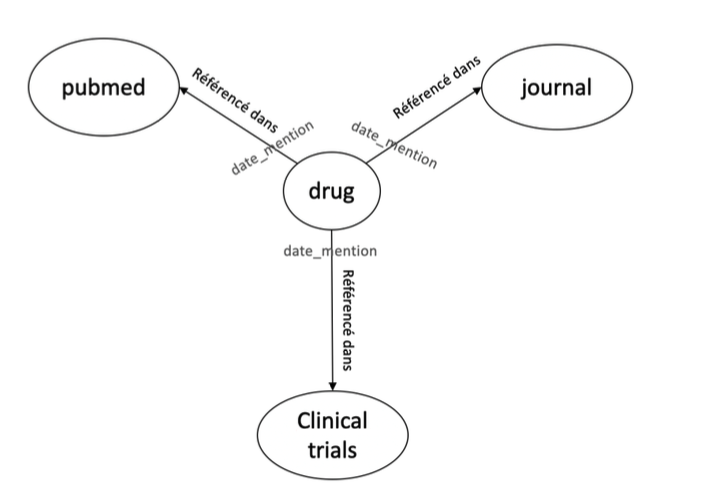

# Introduction

Given datasets of drugs, pubmed publications and clinical trials publications, this package help build a graph json representation of all drugs occurrences.



# Get started
## Install
Once in the package directory, you can install the package locally : 
```
pip install .
```
## Generate JSON Results
From drug_pipeline module directory, run this command to launch the pipeline using default arguments
```
python pipeline_main.py
```
Launch the pipeline using custom file paths, for example,  to execute the pipeline using a custom drug file path :
```
python pipeline_main.py --drugs_file_path "custom_drug_file_path"
```
By default the results json graph is stored in the output directory, you can change this by specifying --output_path argument
```
python pipeline_main.py --drugs_file_path "custom_drug_file_path" --output_path "custum_output_file_path"
```


## Get the journal with most drugs occurrences

Get the name of the journal using all preprocessing steps
```
# import utils functions
from drug_pipeline.adhoc_utils import most_journal_drug_mentions, read_json_results
# Read drug graph results
drug_graph = read_json_results('drug_pipeline/output/results.json')
# Get the journal with maximum drug occurrences 
journal_with_higher_drug_mentions = most_journal_drug_mentions(drug_graph)
print("The journal with most drug mentions is : {}".format(journal_with_higher_drug_mentions))
```

get the journal name using command line 
```
python adhoc_utils.py --output_path "custum_output_file_path"
```


# SQL queries exercise

## Part1
The Query is stored in sql_queries_exercice repo with the name "ventes_par_jour.sql"
## Part2
The Query is stored in sql_queries_exercice repo with the name "ventes_par_type_produit.sql"

# Next steps
## Scaling the solution
To scale the solution to be able to process large volumes of data, I recommend the given improvement :

* Host datasets on other support than csv file, for the GCP environnement, one of the solutions would be BigQuery or MongoDB`
* Partition datasets in case of larger volumes

## Improve the package code quality
* Enrich unit tests
* generate automatic doc using pdoc or MKDocs
* Build the package and publish it to facilitate its use
* Build a continuous integration pipeline
* Use Click package instead of Argparse
